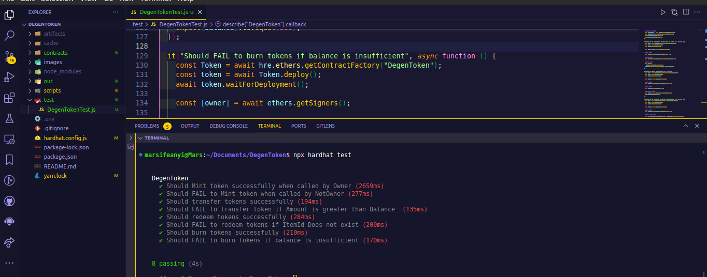
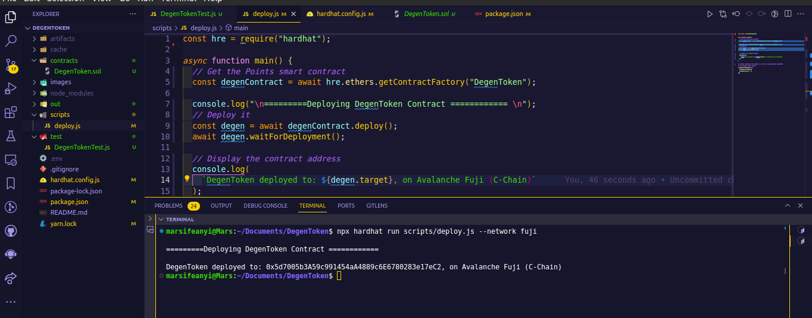
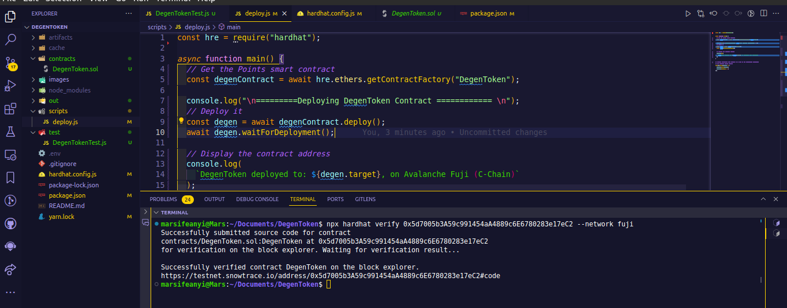
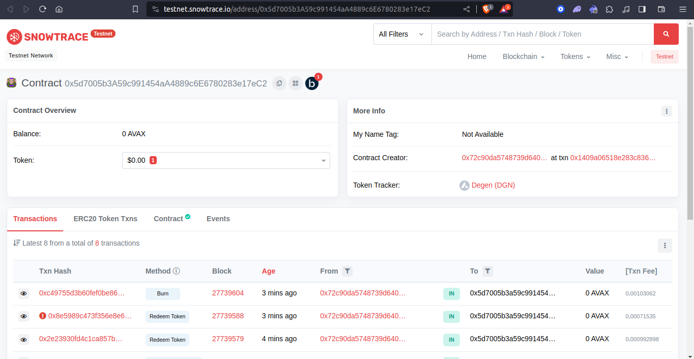
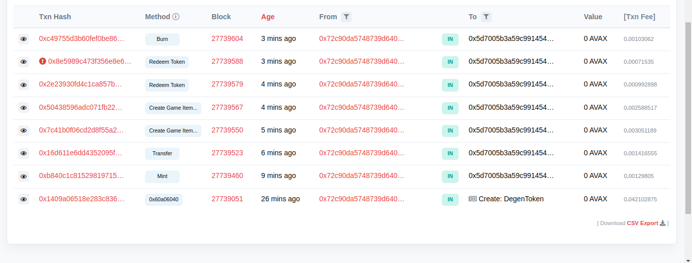

# Degen Gaming Studio Token

## Overview

This is the smart contract Degen Gaming 🎮, game studio token, the `DGN` is a unique token that can to incentivize and reward players for their loyalty and active usage of the Degen Game Studio and their services.

The smart was written in Solidity and deployed to the Avalanche Fuji Testnet(C-chain).
The contract has functionalities that:

- Allows Degen Game Studio to `mint` or create new tokens and distribute them to players as rewards. Only the owner can mint tokens.
- Allows players to `transfer` their tokens to others.
- Allows players to `redeem` their tokens for items in the in-game store.
- Allows players to check their token balance, `balanceOf` at any time.
- Allows anyone to `burn` tokens, that they own, that are no longer needed.

## Table of Contents

- [Degen Gaming Studio Token](#degen-gaming-studio-token)
  - [Overview](#overview)
  - [Table of Contents](#table-of-contents)
    - [Token Information](#token-information)
    - [Functions](#functions)
  - [Testing the smart contract with hardhat script](#testing-the-smart-contract-with-hardhat-script)
  - [Deployments](#deployments)
    - [Deploying Contract](#deploying-contract)
    - [Verifying Contract](#verifying-contract)
    - [Deployed and Verified Contract Address](#deployed-and-verified-contract-address)
  - [Interactions and Testing on the Fuji testnet](#interactions-and-testing-on-the-fuji-testnet)
    - [Demo Video](#demo-video)
  - [Authors](#authors)
  - [License](#license)

### Token Information

- **Name:** Degen
- **Symbol:** DGN

### Functions

`Constructor` Initializes the ERC-20 token with the specified name and symbol.

- Sets the contract deployer as the owner.
- Mints and InitialSupply of `10e18` to the owner.

`mint()`,allows only the owner of the contract to mint new tokens.

```sh
 function mint(address to, uint256 amount) public onlyOwner {
        _mint(to, amount);
    }
```

`transfer`, allows players to transfer their tokens to others.

```sh
 function transfer(
        address to,
        uint256 value
    ) public virtual override returns (bool success) {
        require(balanceOf(msg.sender) >= value, "Insufficient balance");
        success = super.transfer(to, value);
    }
```

`redeemToken`, allows players to redeem their tokens for items in the in-game store.

```sh
function redeemToken(uint8 _itemID) public {
        if (_itemID >= itemId) revert ItemNotFound();

        transfer(
            IdToGameItemsInfo[_itemID].owner,
            IdToGameItemsInfo[_itemID].amount
        );
        IdToGameItemsInfo[_itemID].owner = msg.sender;
    }
```

`balanceOf`, allows players to check their token balance at any time.

```sh

function balanceOf(
        address _account
    ) public view override returns (uint256) {
        return super.balanceOf(_account);
    }

```

`burn`, allows anyone to burn tokens, that they own, that are no longer needed.

```sh
   function burn(uint _amount) public {
        // checks that balance is not greater that amount
        if (balanceOf(msg.sender) < _amount) revert InsufficientBalance();
        _burn(msg.sender, _amount);
    }

```

`createGameItems`, allows Degen game studio to create game items for its users.

```sh
 function createGameItems(
        string calldata _name,
        uint256 _amount
    ) public onlyOwner {
        itemId++;

        GameItemsInfo storage gameItemsInfo = IdToGameItemsInfo[itemId];

        gameItemsInfo.owner = msg.sender;
        gameItemsInfo.name = _name;
        gameItemsInfo.amount = _amount;

        IdToGameItemsInfo[itemId] = gameItemsInfo;
    }

```

## Testing the smart contract with hardhat script

The test cases for all the functions and requirement were tested and all passing.



## Deployments

The contract is deployed on the Avalanche Fuji Testnet(C-chain), [DegenToken](https://testnet.snowtrace.io/address/0x5d7005b3A59c991454aA4889c6E6780283e17eC2#code)

### Deploying Contract



### Verifying Contract



### Deployed and Verified Contract Address

0x5d7005b3A59c991454aA4889c6E6780283e17eC2

https://testnet.snowtrace.io/address/0x5d7005b3A59c991454aA4889c6E6780283e17eC2#code

## Interactions and Testing on the Fuji testnet





### Demo Video

https://www.loom.com/share/47d5f56b602446998c334d4dc07373b6?sid=151df92b-64bc-46a6-86f4-64e3c39850b0

## Authors

Marcellus Ifeanyi
[@metacraftersio](https://twitter.com/Mars_Energy)

## License

This project is licensed under the MIT License - see the LICENSE.md file for details.
